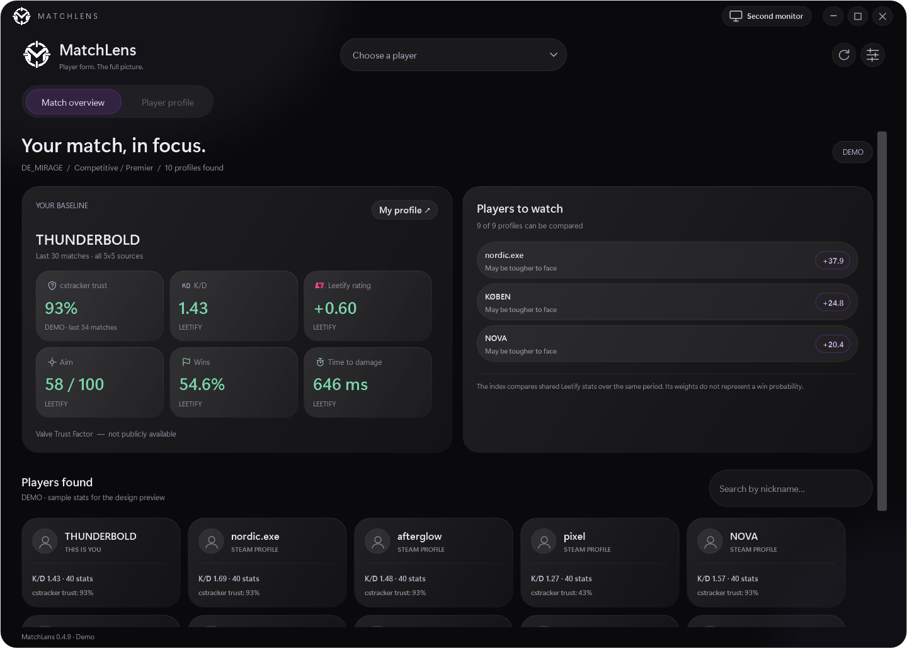
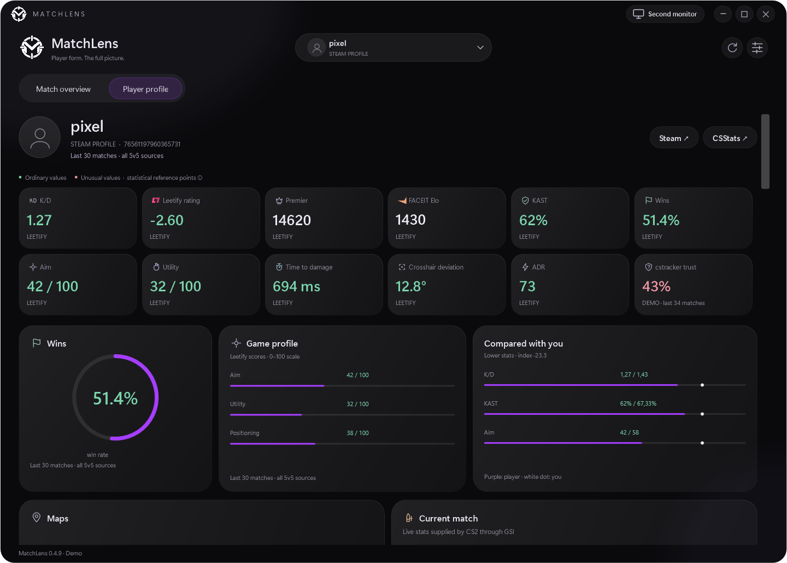
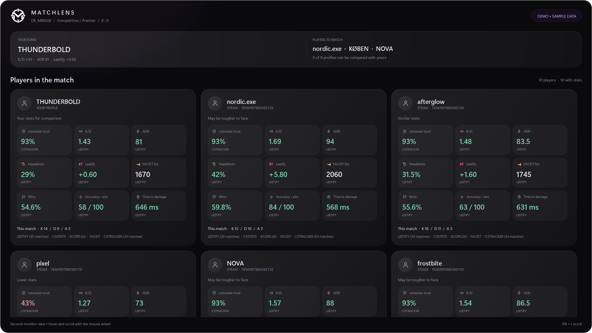

<p align="center">
  
</p>

<h1 align="center">MatchLens</h1>
<p align="center">A clearer picture of your CS2 lobby.</p>
<p align="center"><strong>English</strong> · <a href="README.uk.md">Українська</a></p>
<p align="center">Windows x64 · CS2 · Public player stats</p>

## Installation

1. Download **MatchLens_0.4.9_Windows.zip** from [Releases](https://github.com/ThunderBoldX/MatchLens/releases/latest).
2. Extract the **whole ZIP** into a folder and run **Start.cmd**.
3. Open **Settings** and let MatchLens find your CS2 folder, or select it yourself.
4. Click **Install GSI**, then restart CS2.
5. Keep Steam and MatchLens open before joining your first match.

Join a server and the player list will appear when Steam or GSI supplies the IDs. Stats fill in as they load. Choose a player from the dropdown to see their profile.

**Requirements:** Windows 10/11 x64, Steam, CS2 and an internet connection. The release includes the .NET runtime. If WebView2 is missing, use the installer in `app/Dependencies`.

**Language:** English is the default. Switch to Ukrainian in **Settings → Language → Save**. Updating MatchLens does not require reinstalling GSI.

## Features

- **Automatic player discovery** for Premier, Competitive and other CS2 modes.
- **Individual profiles** with Steam avatars and clear source cards.
- **Public stats** from Leetify, CSStats, cstracker.gg, SCOPE.GG and Steam.
- **FACEIT details** including available Elo, level and recent match history.
- **Charts and metrics:** K/D, ADR, headshots, win rate, aim, maps and rating trends, when available.
- **Your own baseline** and a comparison of players with stronger recent stats.
- **cstracker trust** and colour indicators for ordinary or unusual values.
- **Second-monitor view** that updates automatically and supports scrolling without clicking controls.
- **Telegram summaries** in one edited message, with an idle status after the match.
- **Tray support**, a draggable title bar and **F11 / Alt+Enter** to maximize.

No browser extension, bridge or statistics API keys are needed. Telegram is optional and needs your own bot token and Chat ID.

## Screenshots

Screenshots show fictional demo data.

**Match overview**



**Player profile**



**Second-monitor view**



## Telegram

Create a bot with **@BotFather**, open the bot's chat and press **Start**. Add its token and your numeric Chat ID in **Settings**, enable Telegram and save.

MatchLens keeps the roster and key stats in one message. After the match, it edits that message to **“You are not in a match ❤️⚡”**.

## A few things to know

Public sites may have missing stats, private profiles or request limits. Unavailable values stay **—**.

Steam player lists are a best-effort source and may contain older entries. MatchLens filters known previous-match profiles; a returning player needs current-game GSI confirmation. Start MatchLens before your first match and keep it open between games.

**cstracker trust is the site's score, not Valve Trust Factor.** Red stats are review indicators, not proof of cheating.

## Build from source

Install the **.NET 10 SDK** on Windows, then run from the repository folder:

```powershell
.\Build.ps1
```

The built app is in `src/MatchLens/bin/Release/net10.0-windows`. A source build requires the .NET Desktop and ASP.NET Core runtimes; use the release ZIP for the bundled runtime.

Report a bug through [Issues](https://github.com/ThunderBoldX/MatchLens/issues). Include the app version, mode and what happened. You can copy diagnostics from the app; keep bot tokens private.
